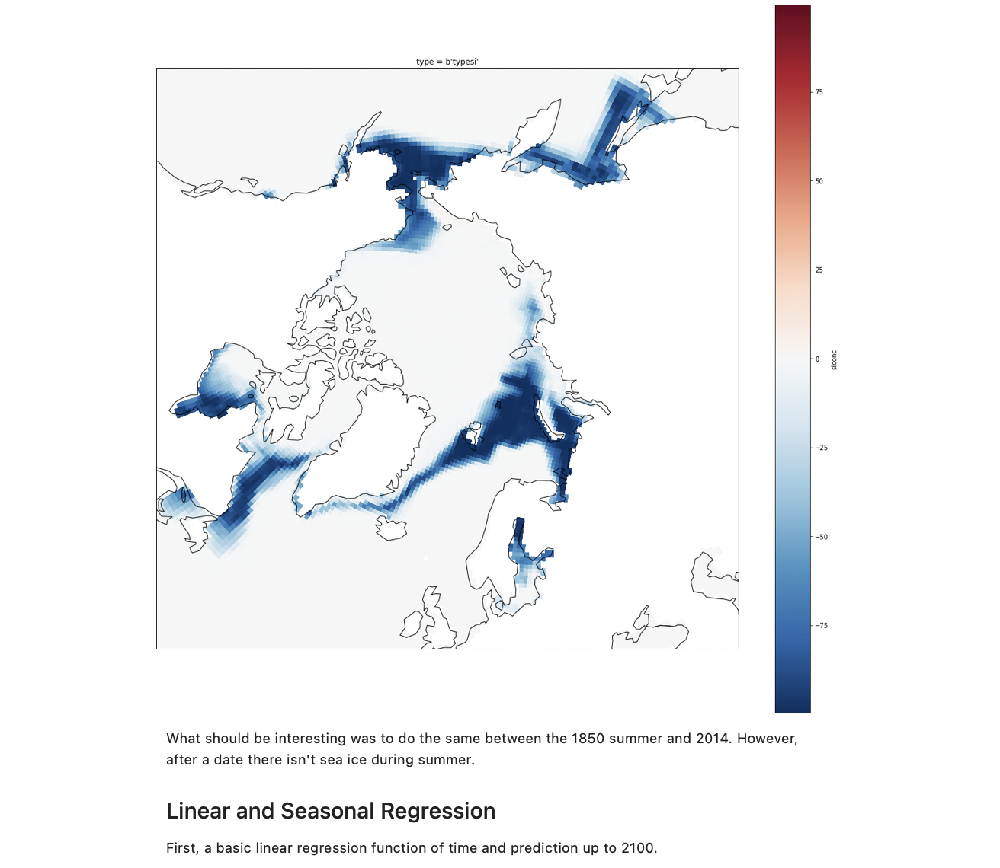
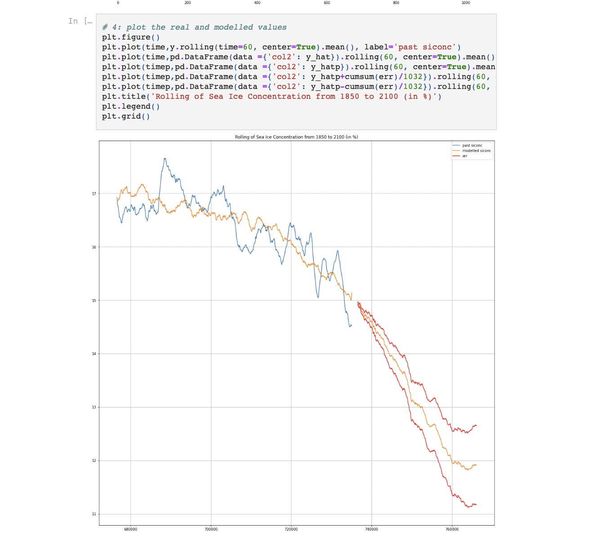

# BDCC-Project (Big Data & Cloud Computing)

The notebook contains the work of our group on Future Artic Sea Ice predictions. But especially, how we intent to reproduce expert sea ice forecast depending on scenarios, by adding feature step by step (like seasonalities or CO2 air concentrations and others ...).

